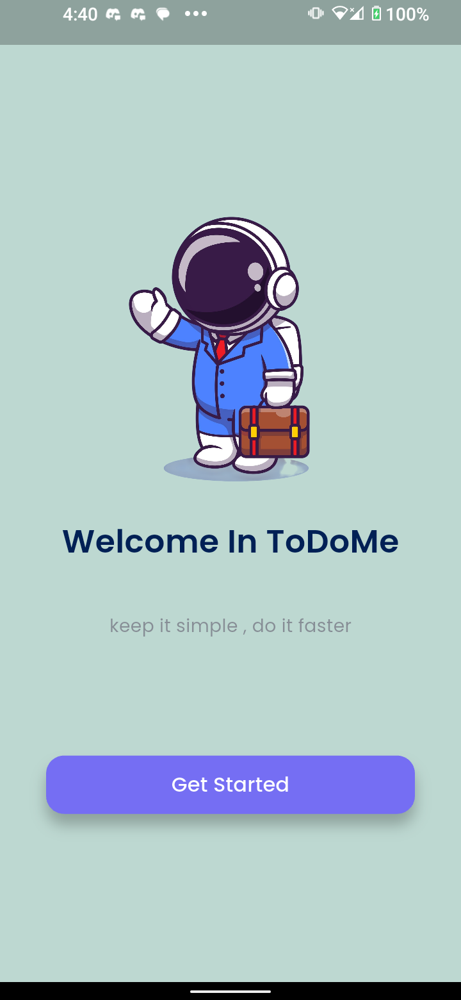
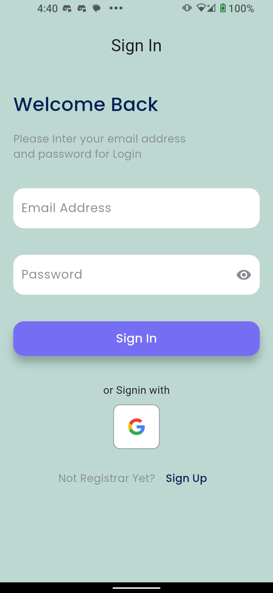
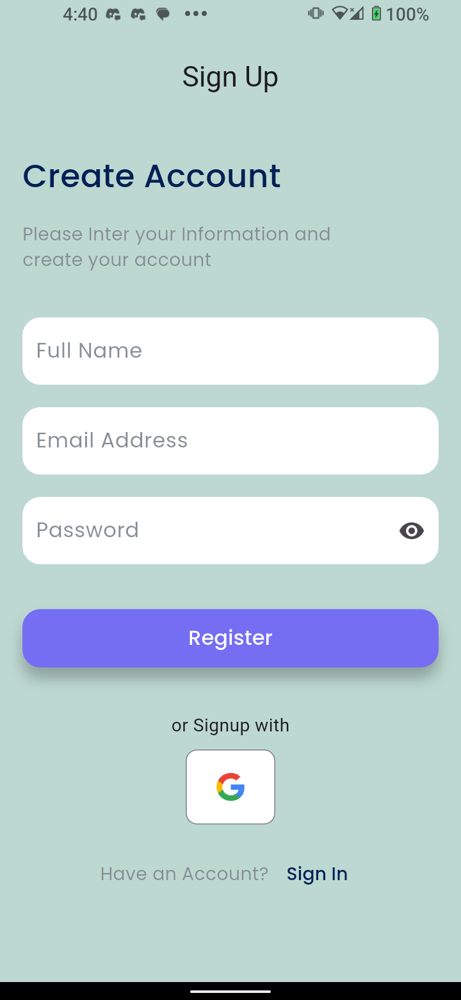
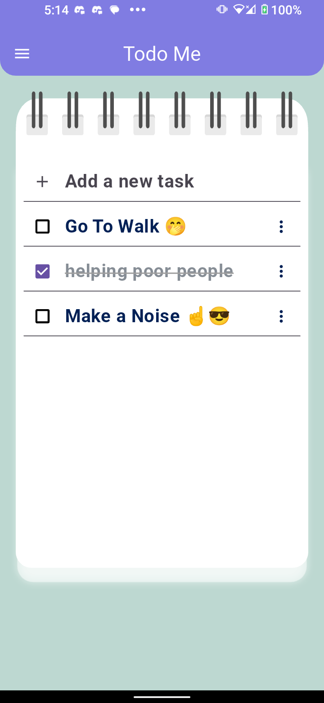
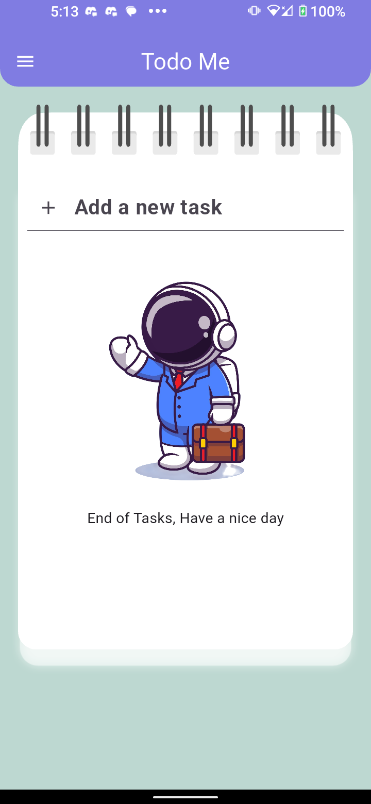
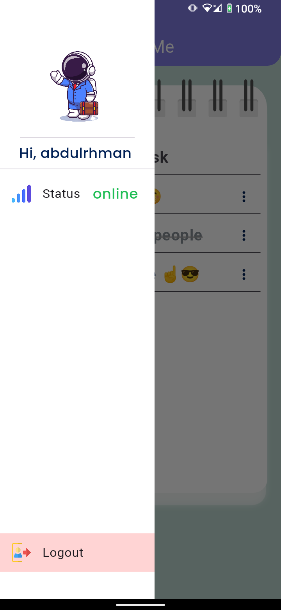

# 📝 ToDoMe

ToDoMe is a simple and intuitive task management app built using Flutter. It allows users to create, manage, and track their tasks efficiently and simply. Whether you're organizing your work tasks or personal to-dos, ToDoMe helps you stay on top of everything.

## ✨ Features

- ➕ Add, edit, and delete tasks
- ✅ Mark tasks as completed


## 🚀 Installation

1. Clone the repository:
    ```bash
    git clone https://github.com/AVElfallah/todo_me.git
    ```
2. Navigate to the project directory:
    ```bash
    cd todo_me
    ```
3. Install dependencies:
    ```bash
    flutter pub get
    ```

4. Run the app:
    ```bash
    flutter run
    ```

## 🤝 Contributing

Contributions are welcome! Please fork the repository and create a pull request. Feel free to open issues for any bugs or feature requests.

## 🛠️ Technologies & Packages

- Flutter
- Dart
- Hive_CE
- Bloc
- FirebaseAuth
- FirebaseFireStore

## App Video 😊 

<video src="video_shots/vid2.mp4" width="320" height="240" controls></video>

## 📸 Screenshots

Stay tuned for screenshots showcasing the app's features and user interface!

1. Splash Screen
<div align='center'>
   <a href="url"></a>
</div>


2. Login Screen
<div align='center'>
   <a href="url"></a>
   </div>


3. SignUp Screen
<div align='center'>
   <a href="url"></a>
   </div>


4. Home Screen
<div align='center'>
   <a href="url"></a>

   </div>

5. Empty Task
<div align="center">
<a href="url"></a>
</div>

6. Drawer
<div align="center">
<a href="url"></a>
</div>